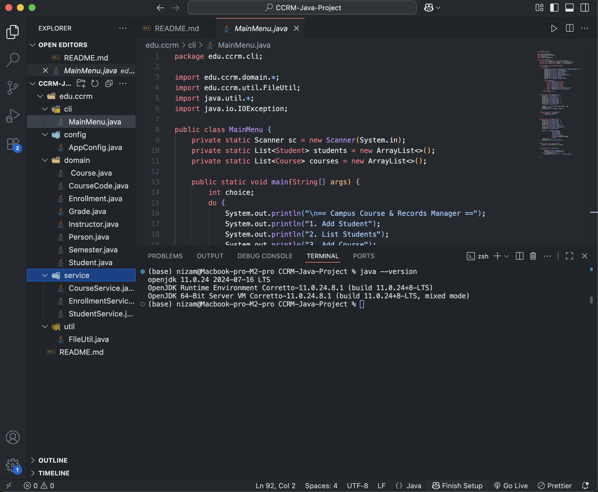
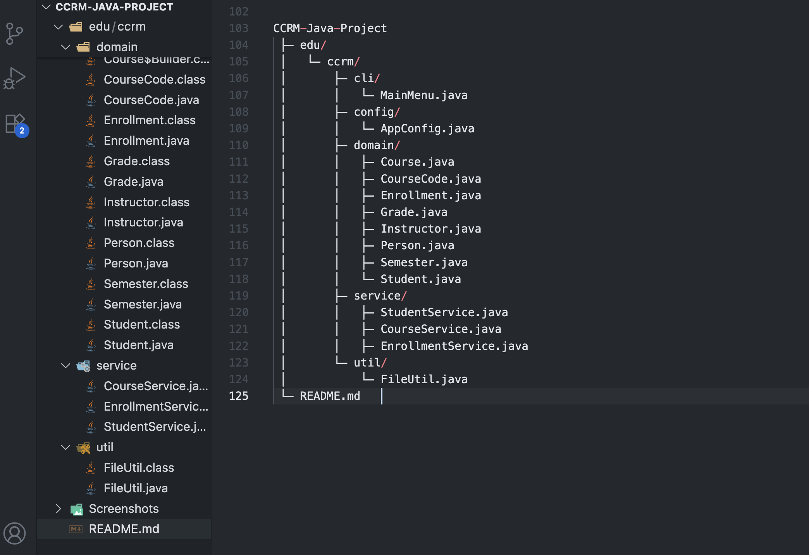
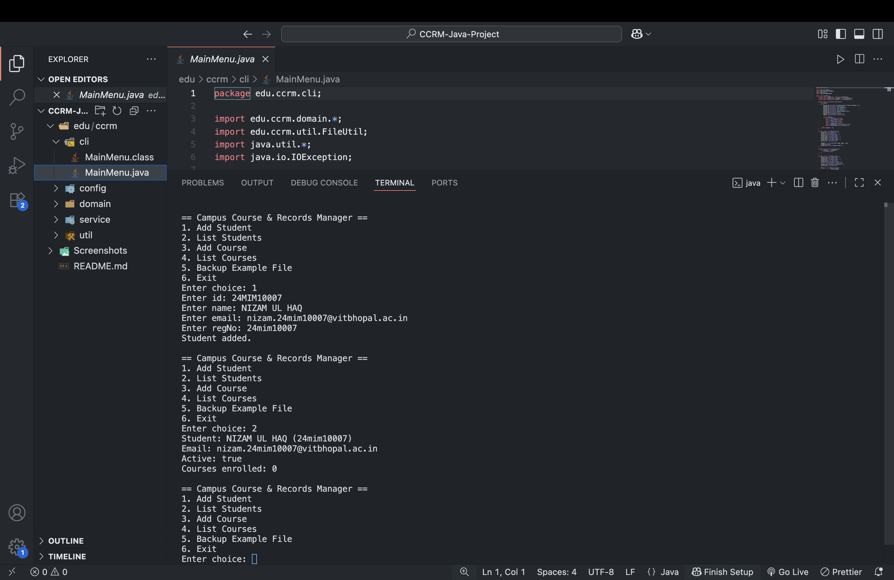
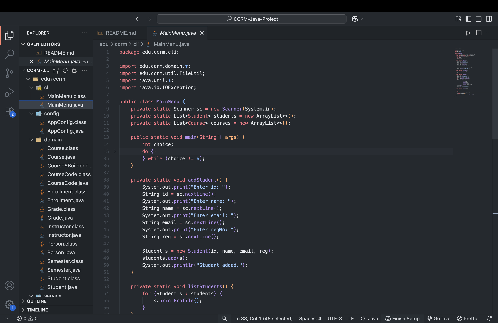

# Campus Course & Records Manager (CCRM)

# Project Overview
This Campus Course & Records Manager (CCRM) is a simple Java console application designed to manage students, courses, and enrollments. The project follows a modular structure with separate packages for CLI (MainMenu), domain models (Student, Course, Enrollment, etc.), services (StudentService, CourseService, EnrollmentService), and utilities (FileUtil). Users can add and list students or courses, enroll students in courses, view enrollments, and perform file backup operations. The implementation is based on object-oriented principles with a layered architecture, making the code clean, organized, and easy to extend in the future (e.g., database integration via JDBC).


# Project Structure

```
CCRM-Java-Project
 ├─ edu/
 │   └─ ccrm/
 │       ├─ cli/
 │       │   └─ MainMenu.java
 │       ├─ config/
 │       │   └─ AppConfig.java
 │       ├─ domain/
 │       │   ├─ Course.java
 │       │   ├─ CourseCode.java
 │       │   ├─ Enrollment.java
 │       │   ├─ Grade.java
 │       │   ├─ Instructor.java
 │       │   ├─ Person.java
 │       │   ├─ Semester.java
 │       │   └─ Student.java
 │       ├─ service/
 |       |       ├─ StudentService.java
 │       |       ├─ CourseService.java
 │       |       └─ EnrollmentService.java
 │       └─ util/
 │           └─ FileUtil.java
 ├─ screenshots/
 └─ README.md  
 
 ```

# Setup & Running

# Requirements
- JDK 17 (or higher)
- VS Code (with Java Extension Pack) / Eclipse IDE

# Steps to Run
1. Open the folder `CCRM-Java-Project` in VS Code.  
2. Navigate to the file: 
        edu.ccrm/cli/MainMenu.java
3. Run the program. The menu-driven CLI will appear in the terminal.


# Evolution of Java
- 1995: Java 1.0 by Sun Microsystems  
- 2004: Java 5 introduced Generics, Enums  
- 2014: Java 8 introduced Streams, Lambdas  
- 2017: Oracle switched to 6-month releases  
- 2021+: Java 17, 21 (LTS versions)  

# Java Editions
| Edition               |    Use Case |

| Java SE               | Standard Edition (desktop/console apps)  |
| Java EE (Jakarta EE)  | Enterprise Edition (web apps, servers)   |
| Java ME               | Micro Edition (mobile, embedded devices) |

# JDK, JRE, JVM
- JVM: Java Virtual Machine –   executes `.class` bytecode  
- JRE: Java Runtime Environment –   JVM + libraries (for running)  
- JDK: Java Development Kit –   JRE + compiler + tools (for development)  


# Installation (Windows Example)
1. Download JDK from [Oracle](https://www.oracle.com/java/technologies/javase-downloads.html).  
2. Install and set `JAVA_HOME`.  
3. Verify installation:
        java -version
        javac -version

 # Mapping of Syllabus Topics → Code
 

```
| Topic           |  Where Used |

| Encapsulation   | `Student.java` (private fields + getters/setters) |

| Inheritance     | `Person → Student, Instructor` |

| Abstraction     | `Person.java` (abstract class with abstract method) |

| Polymorphism    | `printProfile()` overridden in Student/Instructor |

| Immutable class | `CourseCode.java` |

| Nested class    | `Course.Builder` (static nested class) |

| Enum            | `Grade.java`, `Semester.java` |

| Lambda & Stream | `courses.forEach(System.out::println)` in `MainMenu.java`   |

| Singleton       | `AppConfig.java` |

| Builder Pattern | `Course.Builder` |

| Exceptions      | `tryBackup()` in `MainMenu.java` |

| Custom Exception | (to be added, e.g., `MaxCreditLimitException`) |

| File I/O (NIO.2) | `FileUtil.java` |

| Recursion       | `folderSize()` in `FileUtil.java` |

| Date/Time API   | `admissionDate` in `Student.java` |

| Assertions      | `assert credits > 0 : "Credits must be positive";|
```

# Screenshots





        
# Eclipse Setup 
1. File → New → Java Project  
2. Name project: `CCRM-Java-Project`  
3. Copy source files into `edu/ccrm/...`  
4. Run `MainMenu.java`  

# Assertions
In code:
```java
assert credits > 0 : "Credits must be positive";

Run with assertions enabled:
        java -ea edu.ccrm.cli.MainMenu

             or 
# Compile all java files with package structure
        javac -d . $(find edu -name "*.java")

# Run the main program
        java edu.ccrm.cli.MainMenu


        


  
